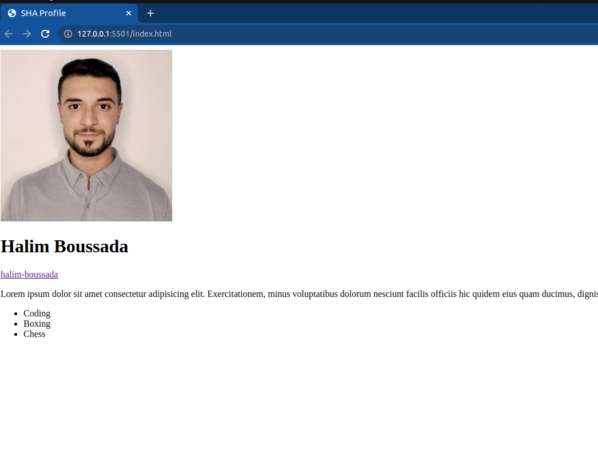

## HTML Basics - My Profile

### GitHub workflow:

- Step 1: Pull the week2 folder from the SHA-C22-FullStackCourse repo by running this command:

  `git pull <your_remote_name> main`

- Step2: Start coding - solve HTML Basics assignment
- Step3: push your work
- Step4: Create a pull request back to your branch

## Instructions:

For this assignment, you're going to create a basic webpage that includes some information about yourself.

<ol> 
<li> Create a new HTML file and save it with a meaningful filename and the ".html" extension. ex: index.html</li>
<li>
 Set up the basic structure of the HTML document, including specifying the HTML version, creating the page header, and setting the title of the page to "Your Name Profile."</li>
<li>Let's  add some content to the webpage:
<ul>
<li>Include an image of yourself using the &lt;img&gt; tag, and set the "src" attribute to the location of your photo on your computer or a web server.

</li>

 
<li>

Include your name as a header tag &lt;h1&gt;.

</li>

 
<li>Add a link tag &lt;a&gt;  to the HTML document and set the "href" attribute to the URL of your Github account. Enter your profile name as the content of the tag.

</li>

 
<li>
  
Write a brief description of yourself (Bio). think about which HTML tag should you use. 
  

</li>

 
<li>Create a list of your hobbies using the &lt;ul&gt;  and &lt;li&gt; tags. This is a great opportunity to showcase some of your interests and help people get to know you better!

</li>

</ul>
</li>
</ol>

- Feel Free to add additional sections to your profile like education, work experience, or skills.

- Upload your project to netlify and submit the link in Athena platform along with the pull request you created in GitHub .

<h3 style="text-align:center">Happy Hacking &#128522</h3>
